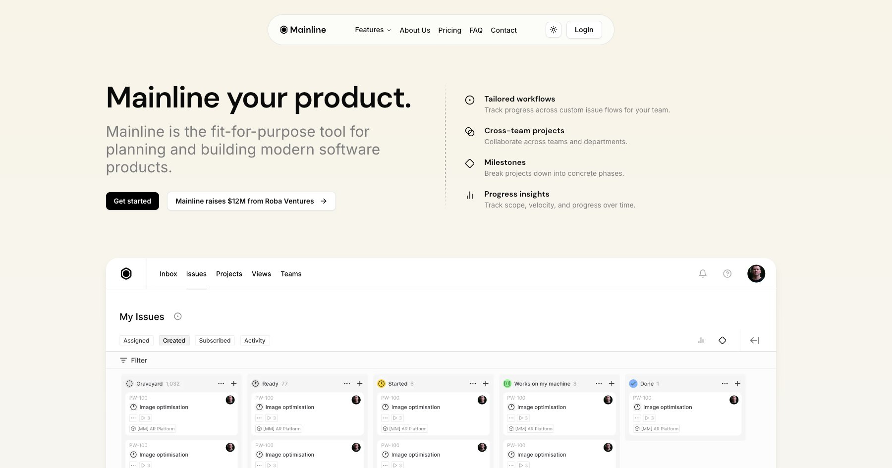

# Mainline Next.js Template

Mainline is a free template built with shadcn/ui, Tailwind 4 and Next.js 15.

- [Demo](https://mainline-nextjs-template.vercel.app/)
- [Documentation](https://docs.shadcnblocks.com/templates/getting-started)
- [Figma](https://www.figma.com/design/cFCLMj7DFv0sK7EVsqKeTa/Mainline?node-id=23250-13201&t=I1nAdchDpknii5Bd-1)



## Getting Started

```bash
npm install
```

```bash
npm run dev
```

Open [http://localhost:3000](http://localhost:3000) with your browser to see the result.

## Features

### Core Technology Stack

- **Next.js 15** with App Router
- **Tailwind CSS 4** for styling
- **shadcn/ui** components
- **TypeScript** support
- **React 19**

### Key Features

- **Shadcn UI**: uses [shadcn/ui](https://ui.shadcn.com/) core UI components
- **Theme System**: Dark/light mode with `next-themes`, compatible with [tweakcn](https://tweakcn.com)
- **Form Handling**: React Hook Form + Zod validation
- **Server Actions**: Next-safe-action integration for server-side logic
- **MDX Support**: For content pages
- **Animations**: Motion library (Framer Motion) integration
- **ESLint/Prettier**: Pre-configured code formatting and linting
- **Custom Fonts**: DM Sans font family included
- **Icons**: Lucide React + React Icons libraries
- **Styleglide Integration**: For component previews/development
- **Responsive Design**: Mobile-friendly layout
- **SEO Ready**: Proper metadata and OG images included

### Pre-built Pages

- Home/Landing page
- About page
- Pricing page
- FAQ page
- Contact page with form
- Login/Signup pages

### Blocks

- Hero section
- Logo showcase/marquee
- Features section
- Resource allocation section
- Testimonials with carousel
- Pricing table
- FAQ with accordion
- Footer
- Navigation bar

## Deployment

Production-ready and tested for deployment on [Vercel](https://vercel.com)

## Credits

- Template by [shadcnblocks.com](https://shadcnblocks.com)
- Design by [Callum Flack](https://x.com/callumflack)
- Dev by [Yassine Zaanouni](https://x.com/YassineZaanouni)
- Produced by [Rob Austin](https://x.com/ausrobdev)
